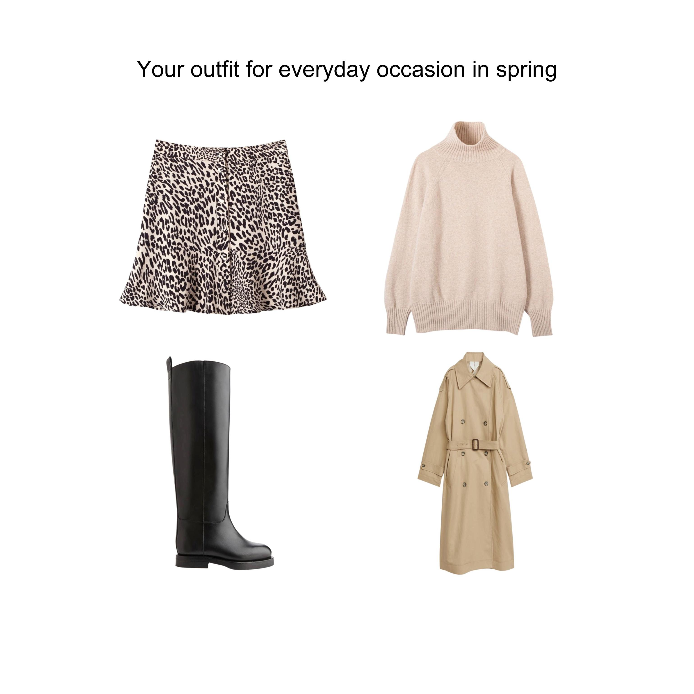

# Capsule Wardrobe - Your Digital Stylist 👗

## Introduction

"What to wear?" - women frequently ask this question and the Capsule Wardrobe Project aims to provide a solution for women. With a focus on simplicity and sustainability, using just 34 clothing items, the goal is to effortlessly create numerous stylish outfits that inspire the user.

## Key Features

- **Present the Concept of Capsule Wardrobe**: provides a short description to help users understand the concept of a Capsule Wardrobe.

- **Outfit Suggestions**: generates outfit ideas based on Capsule wardrobe items, tailored to chosen occasions and seasons and displays them to the user in visual collages.

- **Saving Outfits**: allows users to save the Outfits for future reference. Liked collages are stored in a subfolder named "Favorites".

## Usage

1. **Start**: Users should run the program.

2. **Program Menu**: When the program starts, a welcome message and a short menu appear. Firstly, the program suggests learning more about the Capsule Wardrobe concept. Then it encourages users to try the main function of the program - Generating Outfits.

3. **Generate Wardrobe Outfits**
   1. Upon entering this mode, the program first gathers user preferences through three questions about the occasion, season and clothing item preference (dress, skirt or trousers).
   2. The outfit is then visually displayed in a collage on the user's default image viewer.
   3. The user is prompted to provide feedback on the outfit. If liked, it is saved in the "Favorites" subfolder under "Outfits"; if not, it is stored in the "Outfits" folder so that users can revisit them later.
   4. Users are then asked if they would like to generate another outfit. There is no limit to the number of outfits that can be generated.
4. **History**: Exiting the program doesn't mean losing data. The collages in the "Outfits" folder are retained.

## Technical details

- Language: Python
- Package manager: Poetry pyenv
- Clothing items storage: JSON file
- Clothing items path: clothing images folder
- Results storage: Outfits folder
- Testing: Pytest

## Further ideas how to enhance the Project
- Make the program tailored for men.
- Implement a feature that allows users to easily add new clothing item (but users should not overdo and maintain the project's minimalist philosophy 😀 ). Currently, items can only be added manually by uploading images to the clothing items folder. Images should have a white background, be centered and have dimensions of 1080x1080.
- Enhance user feedback by introducing outfit ratings. Outfit combinations with low ratings should appear less frequently in suggestions.
- Include a section educating users on sustainable fashion tips.

Your contributions and ideas are welcome!

## Enjoy The Capsule Wardrobe!
Happy styling and happy coding!

